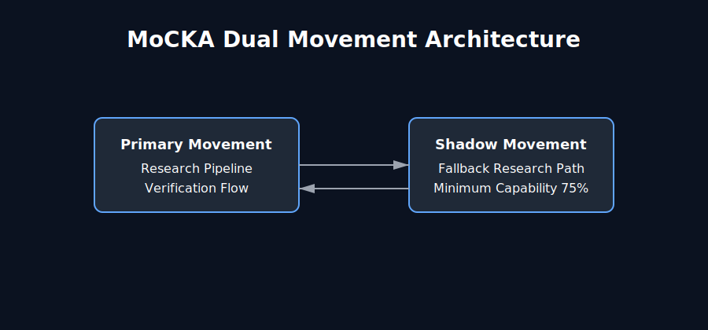
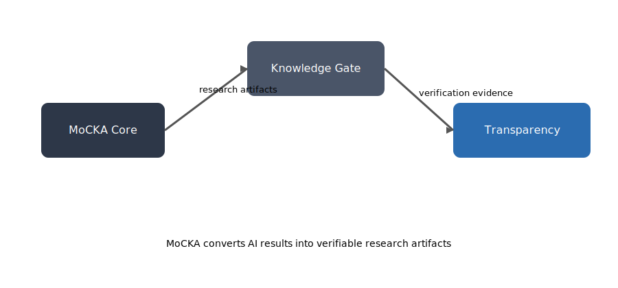

# MoCKA Ecosystem

This repository is part of the **MoCKA Civilization Research Ecosystem**.

MoCKA studies AI civilization systems including governance, consensus and institutional memory.

## Ecosystem Structure

Research Core  
MoCKA

Civilization Theory  
mocka-civilization

Knowledge System  
mocka-knowledge-gate

Transparency Layer  
mocka-transparency

Network Layer  
mocka-outfield

Civilization Core (private)  
mocka-core-private

## 概要

このリポジトリは **MoCKA AI文明研究エコシステム** の一部です。

MoCKAはAI文明の制度、合意形成、知識継承を研究するプロジェクトです。

## 文明構造

研究コア  
MoCKA

文明理論  
mocka-civilization

知識システム  
mocka-knowledge-gate

透明性  
mocka-transparency

ネットワーク  
mocka-outfield

文明コア（非公開）  
mocka-core-private

#  MoCKA Transparency
Verification and Proof Layer of the MoCKA Insight System

MoCKA Transparency is the component of the MoCKA architecture responsible for transforming AI-generated outputs into **verifiable research evidence**.

Most artificial intelligence systems generate answers.  
However, generated answers alone do not constitute knowledge.

Transparency ensures that AI results become **traceable, reproducible, and independently verifiable research artifacts**.

---

##  System Position in the MoCKA Architecture

The MoCKA ecosystem consists of three interacting research layers.

**MoCKA Core**  
Responsible for producing AI reasoning processes and experimental outputs.

**Knowledge Gate**  
Maintains institutional memory and preserves research context.

**Transparency**  
Transforms research outputs into artifacts that can be independently verified.

Within this structure, Transparency functions as the **evidence production layer** of the MoCKA research system.

---

##  Conceptual Foundation

Artificial intelligence can produce answers.

But answers alone do not become knowledge.

Knowledge requires three essential properties.

Traceability  
Verifiability  
Provability  

Without these properties, outputs remain unconfirmed claims.

MoCKA Transparency introduces a structure in which AI results are transformed into **verifiable research artifacts**.

---

##  Dual Movement Architecture

MoCKA maintains research continuity through a dual-movement structure.

###  Primary Movement

The primary operational flow of the research system.

AI outputs are generated and passed through structured verification procedures.

This movement represents the normal research pipeline.

###  Shadow Movement

An auxiliary research path designed to preserve knowledge circulation.

If the primary research flow is interrupted, the Shadow system continues operation.

Shadow maintains a minimum research capability of **approximately seventy-five percent**.

---

##  Verification Architecture

Transparency converts AI outputs into verifiable evidence through a staged process.

The transformation generally follows four stages.

AI Output  
Research Artifact  
Cryptographic Evidence  
Public Verification  

Through this process, research outputs become reproducible and externally auditable artifacts.

---

##  Evidence Construction

Artifacts generated by the Transparency layer are designed for independent validation.

Typical artifact elements include:

experiment identifier  
artifact hash  
signature record  
verification procedure  
reproduction instructions  

These elements allow third parties to confirm research claims without relying solely on trust.

Verification becomes a **deterministic process rather than subjective interpretation**.

---

##  Operational Workflow

The Transparency layer follows a structured verification workflow.

1 AI experiment produces an output  

2 The output is recorded as a research artifact  

3 Cryptographic identifiers such as hashes and signatures are generated  

4 The artifact becomes available for public verification  

Through this workflow, AI outputs are elevated to the level of **scientific evidence**.

---

##  Position in the MoCKA Ecosystem

MoCKA is not merely a system that produces AI results.

It is a research infrastructure designed to support **verifiable knowledge creation**.

MoCKA Core generates experimental outputs.  
Knowledge Gate preserves research context and institutional memory.  
Transparency converts research outputs into verifiable evidence.

Together these layers establish a research environment where knowledge is not only generated but **demonstrably validated**.

---

#  日本語版

MoCKA Transparency  
MoCKA Insight System における検証レイヤー

MoCKA Transparency は AI が生成した結果を  
**検証可能な研究証拠へ変換する仕組み**である。

多くの AI システムは結果を生成するが、  
生成された結果だけでは知識とは言えない。

Transparency は AI の研究結果を  
**追跡可能・再現可能・第三者検証可能**な研究成果物へ変換する。

---

##  MoCKA システム内の位置

MoCKA エコシステムは三つの研究レイヤーで構成される。

**MoCKA Core**  
AI の推論および研究実験結果を生成する層。

**Knowledge Gate**  
研究文脈と制度的記憶を保存する層。

**Transparency**  
研究結果を第三者が検証できる証拠へ変換する層。

この構造において Transparency は  
MoCKA システムの **証拠生成レイヤー**として機能する。

---

##  基本理念

AI は答えを生成することができる。

しかし生成された答えだけでは知識にはならない。

信頼できる知識には次の三つの条件が必要である。

追跡可能性  
検証可能性  
証明可能性  

これらが欠けている場合、結果は単なる主張にすぎない。

MoCKA Transparency は AI の出力を  
**検証可能な研究成果物**へ変換するための構造を提供する。

---

##  デュアルムーブメント構造

MoCKA は二つの循環構造によって研究の継続性を維持する。

###  Primary Movement

研究システムの通常運用経路。

AI 出力が生成され、検証プロセスを通過する。

これは通常の研究サイクルを表す。

###  Shadow Movement

研究継続性を確保する補助経路。

主経路が停止した場合でも Shadow が知識循環を維持する。

Shadow は **約 75% の研究稼働能力**を保持する。

---

##  検証アーキテクチャ

Transparency は AI の結果を段階的に検証可能な証拠へ変換する。

変換プロセスは次の段階で構成される。

AI 出力  
研究成果物  
暗号証拠  
公開検証  

この構造により研究結果は再現可能で外部監査が可能になる。

---

##  証拠生成

Transparency が生成する成果物は第三者による検証を前提として設計されている。

典型的な要素は次の通りである。

実験識別子  
成果物ハッシュ  
署名情報  
検証手順  
再現方法  

これにより研究結果は信頼ではなく  
**検証によって確認できるもの**となる。

---

##  ワークフロー

Transparency の検証フローは決定論的な手順に従う。

1 AI 実験が結果を生成する  

2 結果が研究成果物として記録される  

3 ハッシュと署名が生成される  

4 成果物が公開検証可能になる  

このプロセスにより AI 出力は **科学的証拠**として扱える。

---

##  MoCKA エコシステムにおける役割

MoCKA は AI の結果を生成するだけのシステムではない。

それは **検証可能な知識を生み出す研究基盤**である。

MoCKA Core は研究結果を生成する。  
Knowledge Gate は研究文脈と制度的記憶を保存する。  
Transparency は研究結果を検証可能な証拠へ変換する。

この三層構造により、  
知識は生成されるだけでなく **証明される**。
# MoCKA Ecosystem

This repository is part of the **MoCKA Civilization Research Ecosystem**.

MoCKA studies AI civilization systems including governance, consensus and institutional memory.

## Ecosystem Structure

Research Core  
MoCKA

Civilization Theory  
mocka-civilization

Knowledge System  
mocka-knowledge-gate

Transparency Layer  
mocka-transparency

Network Layer  
mocka-outfield

Civilization Core (private)  
mocka-core-private

## 概要

このリポジトリは **MoCKA AI文明研究エコシステム** の一部です。

MoCKAはAI文明の制度、合意形成、知識継承を研究するプロジェクトです。

## 文明構造

研究コア  
MoCKA

文明理論  
mocka-civilization

知識システム  
mocka-knowledge-gate

透明性  
mocka-transparency

ネットワーク  
mocka-outfield

文明コア（非公開）  
mocka-core-private

